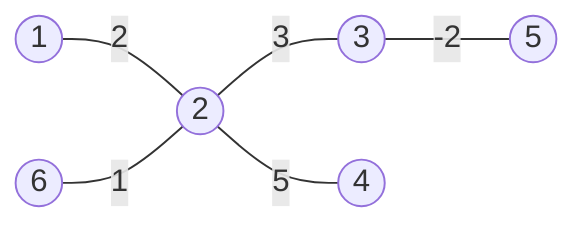
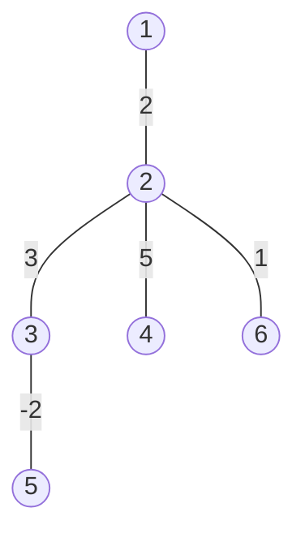
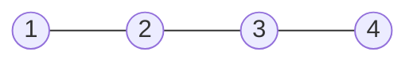
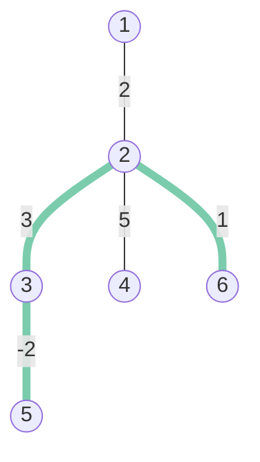

# 概要

複数の典型を組み合わせることが必要となる問題です.  
また，かなりの実装量があり，正確にコーディングすることが求められます．

問題原案：Syntax_Error_

# 解説

問題が複雑であるため，いくつかの段階に分けて解説をします．

## [0] 前提



まず，与えられるグラフは無向木です．この問題では任意の頂点を根と固定しても答えは変わらないため，固定してしまいましょう．



このような形にすることで根を除く頂点と辺が一対一に対応することもポイントです．

## [1] 最小化する式の変形

いきなりですが，最小化するべき式を違う形で表現します．
$w_i$ を辺 $i$ の重み， $c_i$ を辺 $i$ がクエリ全体で単純パスに含まれる回数とすると， $\displaystyle\sum_{1\leq k\leq Q}{f(k)}=\sum_{1\leq i < N}{w_i c_i}$
とすることができます．
これはパスへのクエリを辺への連続したクエリと捉えることで自明です．
したがって，**操作**は $w_i c_i$ が最大となる $i$ に行うのが最適だとわかります．
($w_i c_i\geq0$ なる $i$ が存在しない時は操作を行わないことが最適であることに気を付けてください．)
以上より $c_i$ を数え上げれば元の問題を解くことができるとわかりました．

## [2] 特殊な木でのいもす法の適用

愚直にクエリ毎数え上げると $O(NQ)$となり到底間に合わないので，高速化する必要があります．
まず，特殊な場合として，全ての頂点の次数が $2$ 以下である場合を考えてみましょう．
(つまり一列に並んでいるときです．)



このような特殊なケースでは，辺についていもす法を適用することで $O(N+Q)$ に改善できます．

## [3] 一般の木でのいもす法の適用

一般の木にも同様にいもす法を適用できないでしょうか．まずはクエリを観察してみましょう．
クエリ $(5,6)$ を見てみます．



このクエリでは，そのままいもす法を適用することはできません．
しかしよく見ると，クエリ $(2,5)$ とクエリ $(2,6)$ に分割することによっていもす法が適用できることがわかります．
さらに，頂点 $2$ は $\mathrm{LCA}(5,6)$ であることもわかります．
したがって，クエリ $(a,b)$ は $c=\mathrm{LCA}(a,b)$ とすると クエリ $(a,c)$ とクエリ $(c,b)$ に分割することでいもす法を適用でき，LCA を求めることができれば高速に動作します．
LCA はセグ木やダブリングなどを用いてクエリ毎 $O(1)$ や $O(\log N)$ で求めることができるため．この問題を解くことができました．

## [4] まとめと計算量

以上[0]~[3]より，

- 任意の頂点を根として固定する．
- クエリを LCA で分割し，いもす法を適用する．
- $w_i c_i$ が正かつ最大である辺に操作を行い $0$ にする．
- 総和を求める．

ことでこの問題を解くことができました．

計算量は LCA を求める部分がボトルネックとなり，ダブリングを用いると $O((N+Q)\log{N})$ 時間，セグ木を用いると $O(N+Q\log{N})$ 時間，sparse tableを用いると $O(N\log{N}+Q)$ 時間などで解くことができます．


解説：Syntax_Error_

# 実装例

```cpp:C++
#include <bits/stdc++.h>
#include <atcoder/segtree>
using namespace std;
using namespace atcoder;

// {深さ, 頂点番号}
using S = pair<int, int>;
constexpr int inf = 2147483647;
S op(S a, S b) { return min(a, b); }
S e() { return {inf, -1}; }

void solve() {
  // 入力
  int N;
  cin >> N;
  vector<int> w(N);
  vector<vector<int>> G(N);
  for (int i = 1; i < N; i++) {
    int p;
    cin >> p >> w[i];
    G[p - 1].push_back(i);
  }

  // オイラーツアー
  vector<int> in(N, -1);
  vector<S> V;
  int last{};
  auto dfs = [&](auto self, int v, int d) -> void {
    in[v] = last++;
    V.push_back({d, v});
    for (auto&& u : G[v]) {
      self(self, u, d + 1);
      V.push_back({d, v});
      last++;
    }
  };
  dfs(dfs, 0, 0);
  segtree<S, op, e> seg(V);
  int Q;
  cin >> Q;
  vector<long long> c(N);
  while (Q--) {
    int a, b;
    cin >> a >> b;
    a--, b--;
    if (in[a] > in[b]) swap(a, b);
    int lca = seg.prod(in[a], in[b]).second;
    c[a]++, c[b]++, c[lca] -= 2;
  }

  // いもす法
  auto dfs2 = [&](auto self, int v) -> void {
    for (auto&& u : G[v]) {
      self(self, u);
      c[v] += c[u];
    }
  };
  dfs2(dfs2, 0);
  
  //答えを求める
  // w[0]*c[0]=0を利用して場合分けを回避する
  vector<long long> wc(N);
  for (int i = 0; i < N; i++) wc[i] = w[i] * c[i];
  sort(wc.begin(), wc.end());
  cout << reduce(wc.begin(), wc.end() - 1) << endl;
}

signed main() {
  int $; cin >> $;
  while($--) solve();
}

```
